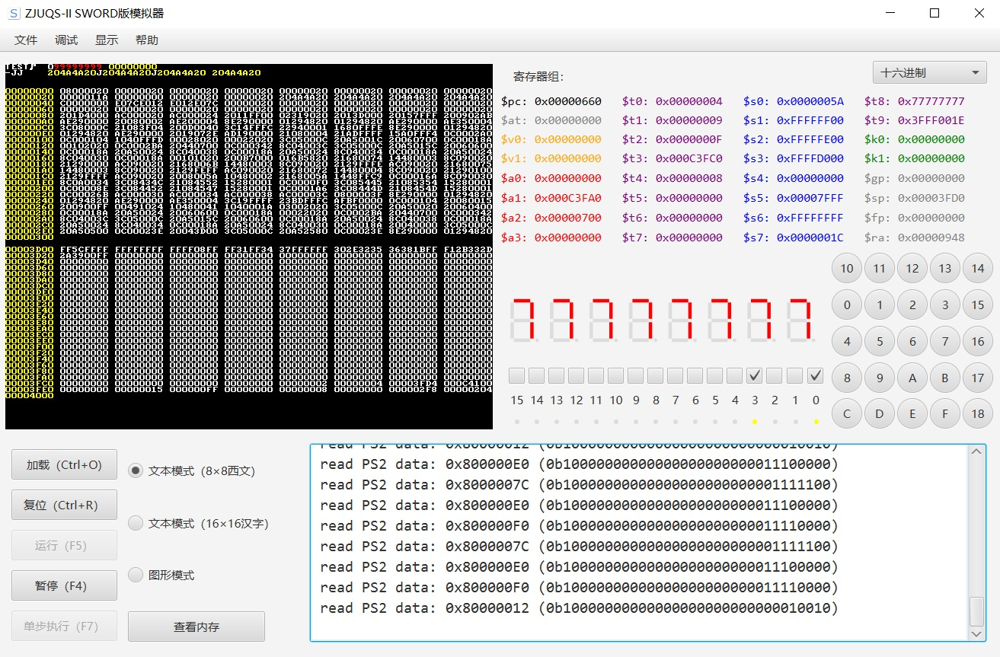
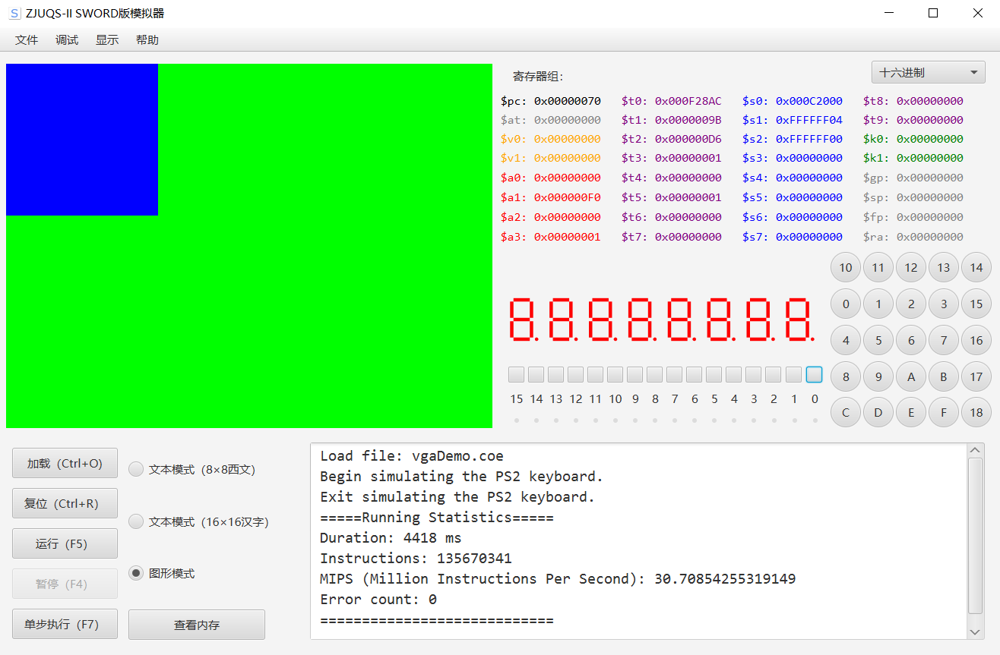
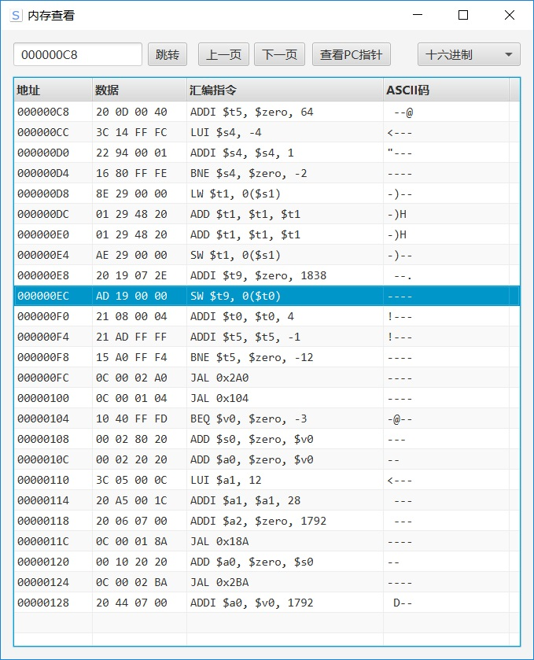

# Sword Emulator
Java implementation of MIPS instruction set and graphical emulator. 
It's designed for ZJU SWORD.

Thanks to Zhanghai for his awesome project [mipsasm](https://github.com/zhanghai/mipsasm).

## Screenshot






## usage
See [here](https://github.com/Keytoyze/Sword_emulator/tree/master/src/res/document/document.pdf).

## Supported Instruction set
See [here](https://github.com/Keytoyze/Sword_emulator/blob/master/src/indi/key/mipsemulator/core/model/Instruction.java).

## Devices
The project supports simulating the following devices.

### Input
- Buttons
- Sliding switches
- PS2 keyboard

### Output
- 7-Segment digital cubes.
- LED
- 640*480 VGA (Including text mode and graphics mode)

### Other
- Counter
- Register viewer
- Memory viewer

# How to run it above the JDK 11?
This project is developed with JDK 8. However, JDK 11 removed JavaFX in the native jdk, which is necessary 
for this project. To run and compile it with JDK 11+, you should download [JavaFX SDK](https://openjfx.io/), 
then use the following compiling / running parameters: 

```--module-path [Java FX SDK] --add-modules javafx.controls,javafx.fxml```